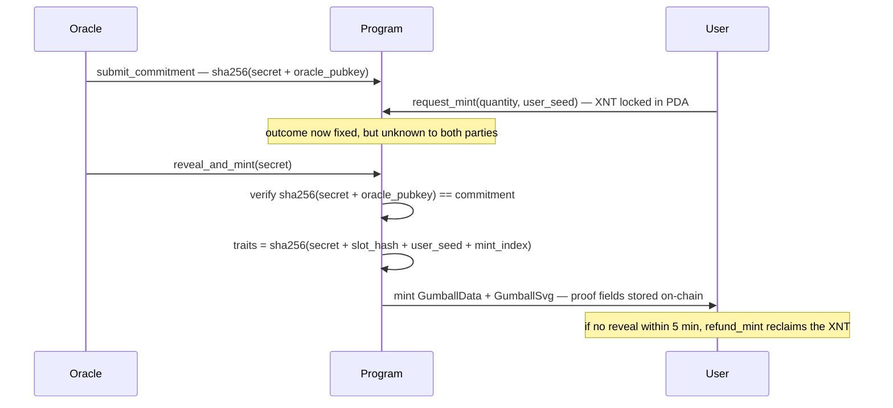
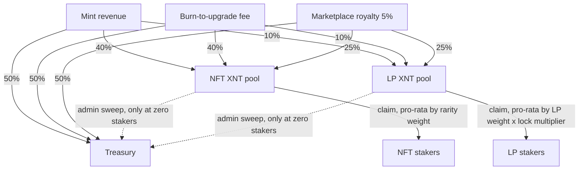

# Gumball Machine NFT — X1

A fully on-chain NFT gumball machine built on Solana/X1. Each NFT is a unique SVG gumball with randomized traits, generated and verified entirely on-chain via a commit-reveal oracle.

**Security Grade: A-** — 5 rounds of core audit plus a dedicated staking/XNT fee-sharing audit and follow-up review round; all findings resolved and validated end-to-end against cloned live state.

**Live app:** https://gumballnft-production.up.railway.app

---

## Quick Start

1. **Get testnet XNT** — visit the [Faucet](https://gumballnft-production.up.railway.app/faucet.html) for 0.1 XNT (funds ~10 mints), once per wallet per 24h
2. **Mint** — connect X1 Wallet / Backpack on the [main page](https://gumballnft-production.up.railway.app) and mint up to 10 gumballs with one approval
3. **Verify fairness** — open `verify.html?serial=<your serial>` to auto-verify the commit-reveal proof stored on-chain in your NFT
4. **Upgrade** — burn duplicates to climb the rarity ladder (guaranteed upgrade instead of random odds)
5. **Stake** — stake gumballs or GUM/XNT LP on the [Staking page](https://gumballnft-production.up.railway.app/staking.html) to earn GUM emissions plus a share of protocol XNT fees
6. **Trade** — list, bid, and buy on the built-in marketplace (5% royalty feeds the staking pools and treasury)

---

## Deployed Contracts

| | Address |
|---|---|
| **Program ID** | `AEahf37KaS548ErtW6RnDtwYrTxxJqkMgg79W9dSNhCy` |
| **Machine PDA** | `Ge8524seSpQ2BLRiMAnk5tg7YRKCTxVscQSxBvPvoyxY` |
| **Network** | X1 Testnet (`https://rpc.testnet.x1.xyz`) |
| **Explorer** | `https://explorer.testnet.x1.xyz` |
| **Mint Price** | 0.01 – 0.04 XNT testnet (exponential curve) |
| **Faucet** | 0.1 XNT per wallet per 24h |
| **Max Supply** | 10,000 |
| **Max Per Tx** | 10 mints per transaction |
| **Mint Timeout** | 300 seconds (5 min) before refund eligible |

### Staking & Fee-Sharing Accounts

| | Address |
|---|---|
| **GUM mint** | `2KjdBhiWdCFoFcNNUbpSWqb67tGWnQpPjcMEYnescyy1` |
| **GUM/XNT LP mint** (XDEX) | `D2bJsDoWVuvykQbMgwFeH7cvuvXZjL2scsjPMVGwNXiV` |
| **Stake config** (`stake_config_v2`) | `HNXj6GmgnPsL1YVs4sfyg5s6WH51RvT2mJhQFqkk7AW1` |
| **NFT reward vault** | `fGakNVv1WcAxqm4RQBHTpyoAW8sc4qcDxXNGiDy7VfW` |
| **LP reward vault** | `6omaC8VtVMNYRMfGcHxpGBdXLDDu2yaRgkavPLtTRVds` |
| **NFT XNT fee pool** | `HoefqtECXfw7ZCCoe9XjUV3pAehthRBG5chTJtgKmtxj` |
| **LP XNT fee pool** | `9EsiAMNYWK12ME1E3KxC87xP911HELCdgFZCAk1tVbmo` |
| **NFT fee state** | `vQQfyjjCWdT9hoBaK58tW5U2PPgn2bs8reZrDYSozhn` |
| **LP fee state** | `5XkBo5Lp3XRWte9YNQc3JJUvftv5Ci4RXLUgiPVK6kDr` |
| **XDEX AMM program** | `7EEuq61z9VKdkUzj7G36xGd7ncyz8KBtUwAWVjypYQHf` |

---

## Oracle Transparency

Randomness is generated via a **commit-reveal scheme**:

1. Oracle generates a random secret off-chain
2. Oracle submits `sha256(secret || oracle_pubkey)` on-chain before any mint request
3. User pays and locks the commitment with a random `user_seed` (unknown to oracle)
4. Oracle reveals the secret — contract derives traits from `sha256(secret || slot_hash || user_seed || mint_index)`

The oracle cannot predict or manipulate outcomes: slot hash (32 bytes) is unknown at commit time, user seed is unknown until after commit is submitted.



| | |
|---|---|
| **Oracle wallet** | `53fTZRZmMMbgWLxkLMtxgECNXcd1iXbVw8aNKrT7RxKy` |
| **Faucet wallet** | `BW74FxoPQua2WRMB2hXXK4EegPpXFjEKoPoD38XY9iDJ` |

---

## Trait System

| Trait | Options | Notes |
|---|---|---|
| **Flavor** | 20 (Cherry, Grape, Watermelon, Blueberry...) | |
| **Color** | 12 (Cherry Red, Grape Purple, Rose Gold...) | |
| **Special** | None, Glitter, Double Bubble, Holographic, Crystal | |
| **Rarity** | Common / Uncommon / Rare / Epic / Legendary | Weighted random |

### Rarity Odds

| Rarity | Drop Rate | Score Weight |
|---|---|---|
| Common | 60% | 1 pt |
| Uncommon | 25% | 4 pt |
| Rare | 10% | 10 pt |
| Epic | 4% | 40 pt |
| Legendary | 1% | 100 pt |

---

## Burn to Upgrade

All four upgrade paths are fully implemented and tested:

| From | To | Burns Required | Instruction |
|---|---|---|---|
| Common | Uncommon | 5 | `burn_multi` |
| Uncommon | Rare | 3 | `burn_multi` |
| Rare | Epic | 2 | `burn_to_upgrade` |
| Epic | Legendary | 2 | `burn_to_upgrade` |

Each upgrade charges an **upgrade fee** equal to the current dynamic mint price, sent to treasury. Upgrading costs the same as minting a new NFT — but you get a **guaranteed** rarity increase instead of random odds.

Burns now auto-reclaim rent in the same transaction. No zombie PDAs are created.

Burns are blocked once `total_minted >= max_supply` — no new serial numbers can be issued when sold out.

---

## GUM Token & Swap

**GUM** is the reward token earned by staking. It is a fixed-supply SPL token — **1,000,000,000 GUM** (6 decimals) with the **mint authority revoked**, verifiable on-chain at `2KjdBhiWdCFoFcNNUbpSWqb67tGWnQpPjcMEYnescyy1`. No more GUM can ever be created; all emissions come out of the pre-funded reward vaults.

| | |
|---|---|
| **Earn** | Stake gumball NFTs or GUM/XNT LP — vaults emit 0.3% of their balance per day, pro-rata by stake weight |
| **Swap** | `staking.html` has a built-in GUM ⇄ XNT swap routed through the XDEX CP-AMM pool on X1 |
| **Provide liquidity** | LP tokens from the XDEX GUM/XNT pool can be staked with lock tiers for boosted weight + XNT fee share |

The swap quotes live pool reserves, applies slippage protection (`minimum_amount_out`), and caps MAX swaps to the token's full decimal scale so rounding can never overshoot your balance.

---

## Staking & XNT Fee Sharing

Two staking streams earn GUM emissions plus a share of protocol XNT fees (`staking.html`):

### NFT Staking

Stake gumballs to earn GUM from the NFT reward vault (0.3% of vault balance per day, distributed pro-rata by rarity weight: 1 / 9 / 47 / 156 / 591 for Common → Legendary).

### LP Staking

Stake GUM LP tokens with a lock tier. Each position mints a tradeable position NFT — whoever holds it controls the position.

| Tier | Lock | Weight Multiplier | Early-Exit Penalty |
|---|---|---|---|
| Flexible | none | 1.0× | 0% |
| Bronze | 30d | 1.5× | 10% |
| Silver | 90d | 2.0× | 15% |
| Gold | 180d | 3.0× | 20% |
| Diamond | 365d | 5.0× | 25% |

Half of any early-exit penalty is burned; half stays in the vault as deferred rewards.

### XNT Fee Sharing

Protocol fees flow automatically into two lamport pools and are distributed pro-rata by stake weight (MasterChef-style accumulator with per-position `XntDebt` snapshots):

| Source | Treasury | NFT Pool | LP Pool |
|---|---|---|---|
| Mint revenue | 50% | 40% | 10% |
| Burn-to-upgrade fee | 50% | 40% | 10% |
| Marketplace royalty | 50% | 25% | 25% |



Fee-sharing guarantees (hardened in the 2026-07 review round):

- Positions only earn fees deposited **after** they staked — debt is snapshotted at stake-time, and fees deposited while nobody is staked are absorbed so a flash-staker can't capture them
- If the pool can't cover a claim in full, the unpaid remainder **stays pending** (debt advances only by what was actually paid); a claim that can pay nothing fails loudly instead of silently succeeding
- Pool PDAs always retain their rent-exempt minimum — they can never be tombstoned
- `XntDebt` PDAs are closed with rent refunded on unstake / full LP withdrawal — no rent leaks
- Unattributable lamports (zero-staker deposits, legacy forfeits, rounding dust) are recoverable to treasury via admin `sweep_xnt_pool_*`, gated on the stream having **zero stakers** so no live entitlement can be touched

---

## Instructions

| Instruction | Caller | Description |
|---|---|---|
| `initialize_machine` | Admin | Set up the gumball machine |
| `set_active` | Admin | Enable/disable minting |
| `set_oracle` | Admin | Rotate oracle wallet |
| `set_mint_price` | Admin | Update base mint price |
| `withdraw` | Admin | Withdraw treasury funds |
| `migrate_machine` | Admin | Migrate machine account to new struct size |
| `reset_counts` | Admin | Reset total_minted and total_burned to zero |
| `submit_commitment` | Oracle | Submit randomness commitment pre-mint |
| `request_mint` | User | Pay and lock 1-10 mints in one transaction |
| `reveal_and_mint` | Oracle | Reveal secret and mint NFT (loops for multi-mint) |
| `refund_mint` | User | Reclaim XNT after oracle timeout (5 min) |
| `burn_to_upgrade` | User | Burn 2 gumballs + fee (Rare to Epic or Epic to Legendary) |
| `burn_multi` | User | Burn 3-5 gumballs + fee (Common to Uncommon or Uncommon to Rare) |
| `update_owner` | Anyone | Sync gumball owner to current token holder after trade |
| `list_gumball` | User | List NFT for sale at fixed price (escrowed) |
| `delist_gumball` | Seller | Cancel listing, NFT returned |
| `buy_gumball` | User | Buy listed NFT (95% to seller, 5% royalty to treasury) |
| `make_offer` | User | Place bid with XNT escrowed in PDA |
| `cancel_offer` | Buyer | Cancel bid, XNT returned |
| `accept_offer` | Seller | Accept bid, NFT transferred (95/5 split) |
| `initialize_staking` | Admin | Set up stake config + GUM reward vaults (gated on machine.authority) |
| `initialize_xnt_fees` | Admin | Create the XNT fee pools + accumulator state PDAs |
| `stake` / `unstake` | User | Stake/unstake a gumball NFT (unstake settles pending XNT + closes XntDebt) |
| `claim` | User | Claim pending GUM rewards for a staked NFT |
| `stake_lp` / `unstake_lp` | User | Stake/unstake LP with lock tier (position NFT minted/burned) |
| `claim_lp` | User | Claim pending GUM rewards for an LP position |
| `claim_xnt_fees_nft` / `claim_xnt_fees_lp` | User | Claim accumulated XNT fee share |
| `sweep_xnt_pool_nft` / `sweep_xnt_pool_lp` | Admin | Recover unattributed pool lamports to treasury (only when stream has zero stakers) |
| `recover_legacy_v1_stake` | User | Recover an NFT staked under the pre-Phase-1 layout |

---

## Security Audit Status

5 rounds of security audit completed. All findings resolved.

| ID | Issue | Severity | Status |
|---|---|---|---|
| C-1 | Free upgrade exploit — no PDA seed constraints | Critical | Fixed |
| C-2 | Oracle randomness manipulation | Critical | Fixed (commit-reveal) |
| C-3 | Oracle brute-force user seed at reveal | Critical | Fixed (user seed mixed post-commit) |
| M-1 | Oracle pubkey hardcoded | Medium | Fixed (rotatable via set_oracle) |
| M-2 | No mint timeout / stuck funds | Medium | Fixed (5 min timeout + refund_mint) |
| H-2 | Traded NFTs non-upgradeable | High | Fixed (update_owner) |
| H-4 | Raw lamport manipulation | High | Fixed |
| A-1 | Payment division rounding in batch mints | High | Fixed (last mint sweeps remainder) |
| A-2 | Oracle secrets stored in plaintext | High | Fixed (AES-256-GCM encryption) |
| A-3 | Double refund via reveal_and_mint timeout | Medium | Fixed (sets fulfilled = true) |
| A-4 | Missing bounds checks in burn instructions | Medium | Fixed (InvalidAccount error) |
| A-5 | Command injection in monitor script | Critical | Fixed (execFile + whitelist) |
| A-6 | Unsafe .unwrap() in seed derivation | Critical | Fixed (.map_err) |
| A-7 | Silent slot hash fallback in burns | High | Fixed (error on failure) |
| A-8 | Rent sweep returns 0 on insufficient lamports | High | Fixed (require > 0) |
| A-9 | Unchecked integer multiply in pricing | High | Fixed (checked_mul) |
| MED-4 | Inconsistent slot hash entropy in burn_to_upgrade | Medium | Fixed (32-byte hash) |

**Core contract audit: CLEAN — A- grade.**

### Phase 2 staking / XNT fee-sharing audit (2026)

| ID | Issue | Severity | Status |
|---|---|---|---|
| CRIT-1 | Pool PDA drainable below rent exemption (tombstone bricks all fee instructions) | Critical | Fixed (rent-min reserve on every payout) |
| CRIT-2 | Pool rent counted as fee revenue on first accumulator update | Critical | Fixed (last_seen seeded with rent balance) |
| CRIT-3 | Fresh position could claim the entire historical accumulator | Critical | Fixed (stake-time XntDebt snapshot + first-touch guard) |
| HIGH-1 | Weight changes diluted fees deposited before the change | High | Fixed (accumulator advances with OLD weight before every weight change) |
| HIGH-2 | initialize_staking front-runnable — attacker could seize stake authority | High | Fixed (gated on machine.authority) |
| HIGH-3 | Partial LP unstake left XntDebt drifted vs. the smaller position | High | Fixed (settle + re-snapshot at new weight) |
| R-1 | Partial payouts silently forfeited the unpaid remainder | High | Fixed (debt advances only by amount paid) |
| R-2 | Zero-staker / legacy-forfeit lamports permanently stranded in pools | High | Fixed (admin sweep, gated on zero stakers) |
| R-3 | XntDebt rent leaked forever on every full LP unstake | Medium | Fixed (PDA closed, rent refunded) |
| R-4 | Claim against an empty pool silently succeeded with no transfer | Medium | Fixed (loud InsufficientFunds) |
| R-5 | Settle logic copy-pasted 4× with diverging behavior | Medium | Fixed (shared settle_xnt_fees helper) |

All fixes validated with a 21-check end-to-end suite against a local validator seeded with cloned live testnet state (`scripts/validate-staking-localnet.cjs`).

---

## Running the Oracle

The oracle persists secrets (AES-256-GCM encrypted) to `oracle-secrets.json` and recovers pending requests on restart. It auto-submits a new commitment after each fulfilled batch.

```bash
# Run directly
node scripts/oracle.cjs

# Run with PM2 (auto-restart on crash)
pm2 start ecosystem.config.cjs
pm2 save
pm2 logs gumball-oracle
pm2 status
```

Logs are written to `logs/oracle-out.log` and `logs/oracle-error.log`.

### Telegram Monitoring

A monitoring bot runs alongside the oracle and sends alerts to Telegram:

| Alert | Trigger |
|---|---|
| Oracle down | PM2 status changes from online to stopped/errored |
| Oracle recovered | Comes back online after being down |
| Mint request expiring | Unfulfilled request < 60s from 5-min timeout |
| Low oracle balance | Oracle wallet below 0.5 XNT |

Telegram commands:

| Command | Description |
|---|---|
| `/status` | Oracle status, balance, pending requests, total minted/burned |
| `/restart` | Restart the oracle process |
| `/stop` | Stop the oracle process |
| `/balance` | Check oracle wallet balance |
| `/help` | Show available commands |

Setup: create a Telegram bot via @BotFather, add `TELEGRAM_TOKEN` and `TELEGRAM_CHAT` to `.env`, then start the monitor via PM2.

### Environment Variables

Create a `.env` file (gitignored) with:

```
TELEGRAM_TOKEN=your_bot_token
TELEGRAM_CHAT=your_chat_id
ORACLE_ENCRYPTION_KEY=your_256bit_hex_key
FAUCET_WALLET=./faucet-wallet.json

# Optional public announcement bot (posts mints/upgrades/sales to a public channel)
TELEGRAM_ANNOUNCE_CHAT=@your_public_channel

# Optional faucet hardening
FAUCET_IP_LIMIT=3                    # requests per IP per 24h (default 3)
FAUCET_STATE_FILE=./faucet-state.json # cooldown persistence (point at a volume on Railway)
TURNSTILE_SITE_KEY=...               # set both to require a Cloudflare Turnstile captcha
TURNSTILE_SECRET_KEY=...
```

Generate an encryption key: `node -e "console.log(require('crypto').randomBytes(32).toString('hex'))"`

Load env before starting: `export $(cat .env | xargs) && pm2 start ecosystem.config.cjs`

---

## Development

```bash
# Build and deploy
anchor build
anchor deploy --provider.cluster https://rpc.testnet.x1.xyz --provider.wallet ~/.config/solana/id.json

# Initialize machine (first time only)
node scripts/initialize.cjs

# Migrate machine account (after Machine struct changes)
node scripts/initialize.cjs --migrate

# Staking setup — REQUIRED before any stake/unstake on a fresh Program ID
# (all four staking instructions require the XNT fee PDAs to exist)
node scripts/init-staking.cjs
node scripts/init-xnt-fees.cjs

# Admin: recover unattributed XNT pool lamports to treasury (zero stakers only)
node scripts/sweep-xnt-pool.cjs [nft|lp]
```

### Local validation (before deploying staking changes)

Runs 21 end-to-end checks against a local validator seeded with **cloned live
testnet state** plus the freshly built program — sweep recovery, stake/claim
math, rent-leak close, flash-stake protection:

```bash
node scripts/make-localnet-fixtures.cjs          # clone live state -> fixture JSONs
solana-test-validator --reset \
  --bpf-program AEahf37KaS548ErtW6RnDtwYrTxxJqkMgg79W9dSNhCy target/deploy/gumball_nft.so \
  --account <pubkey> <fixture.json> ...          # one pair per fixture file
RPC=http://127.0.0.1:8899 NFT_MINT=<from fixtures> TREASURY=<from fixtures> \
  node scripts/validate-staking-localnet.cjs
```

Note: on Windows, run the validator inside WSL (`solana-test-validator` can't
unpack its genesis archive on Windows); the node scripts work from either side.

---

## Frontend

Serve `index.html` over HTTPS — required for wallet connections:

```bash
# Install mkcert (one time)
mkcert -install && mkcert localhost

# Serve with HTTPS
npx serve . -p 3001 --ssl-cert localhost.pem --ssl-key localhost-key.pem
```

Open `https://localhost:3001` and connect your X1 Wallet or Phantom.

### Features

- Batch minting — up to 10 NFTs with a single wallet approval
- Dynamic pricing — live price display updates from on-chain state
- Live collection — on-chain SVG rendering with rarity-colored glow effects
- Rarity filters — filter by Common / Uncommon / Rare / Epic / Legendary
- Burn to upgrade — all 4 upgrade paths with upgrade fee display and pre-simulation
- Refund expired — claim XNT back if oracle was down during your mint
- Testnet faucet — get 0.1 XNT per wallet per 24h to test minting
- Oracle countdown — live timer showing mint request timeout
- Marketplace — list, buy, sell, make/accept offers with 5% royalty
- Staking — stake NFTs and LP positions for GUM emissions + XNT fee share (staking.html)
- Activity feed — live feed of mints, burns, sales with filters
- Collection analytics — rarity score, portfolio value, completion tracker
- Leaderboard — top holders, rarity distribution, auto-refreshes every 60s
- Provably fair verification — verify.html with on-chain proof fields + auto-verification (v5)
- Landing page — project homepage with live mint counter
- Wallet auto-connect — stays connected across page navigation
- Mobile responsive — hamburger menu on all pages
- Loading skeletons — shimmer placeholders while data loads
- Friendly error messages — human-readable error translations
- Confetti animation — celebration on successful mint/burn
- SVG favicon — gumball icon on browser tab

---

## Supply and Economics

- Total supply: 10,000 hard cap enforced on-chain
- Treasury: all mint + upgrade fee proceeds sent to treasury wallet, withdrawable by admin
- Burns: reduce circulating supply; total_burned tracked on-chain
- Upgrades: consume input tokens + upgrade fee, mint new serial at higher rarity; blocked at max supply

### Dynamic Mint Pricing

Mint price follows an exponential curve: `price = BASE_PRICE * 4^(total_minted / 10,000)` XNT.

Early minters pay less. Price increases as supply fills up.

**Testnet pricing:**
| Mint # | Price |
|---|---|
| 1 | 0.01 XNT |
| 2,500 | 0.014 XNT |
| 5,000 | 0.02 XNT |
| 7,500 | 0.028 XNT |
| 10,000 | 0.04 XNT |

Batch mints (up to 10) sum each mint's individual price. Upgrade fees also follow this curve.

---

## Verification

Visit `verify.html?serial=42` to independently verify any gumball's provable fairness.

For v5 gumballs, the commitment hash, user seed, and oracle secret are all stored on-chain. The verify page automatically computes `sha256(secret + oracle_pubkey)` and confirms it matches the stored commitment — fully trustless, no external input needed. For older v4 gumballs, users can paste the oracle secret manually.

---

## Architecture

```
GumballData  seeds: [b"gumball", mint.key()]  — 189 bytes (v5, traits + proof fields + oracle_secret)
GumballSvg   seeds: [b"svg", mint.key()]       — 788 bytes (on-chain SVG artwork)
Listing      seeds: [b"listing", mint.key()]  — 89 bytes (marketplace listing)
Offer        seeds: [b"offer", mint, buyer]   — 89 bytes (marketplace offer)
```

SVG is stored in a separate PDA to keep GumballData lean for burn instructions (32KB SBF heap limit). Burns load 3-5 GumballData accounts simultaneously — at 189 bytes each, well within limits.

---

## Deployment

The project runs on Railway with a single Express server serving frontend + oracle + monitor:

```bash
# Local development
npx serve . -p 3001 --ssl-cert localhost.pem --ssl-key localhost-key.pem

# Railway (automatic via git push)
# Set env vars: ORACLE_WALLET_KEY, ORACLE_ENCRYPTION_KEY, TELEGRAM_TOKEN, TELEGRAM_CHAT, FAUCET_WALLET_KEY
```

Live URL: `https://gumballnft-production.up.railway.app`

---

## Known Limitations

- Oracle must be running for mints to fulfill — auto-restarts on crash, Telegram monitor alerts if down. Users can reclaim XNT via refund after 5 minutes
- Oracle can choose when to reveal within the 5-min window, but cannot predict or control traits
- Faucet cooldowns are in-memory — reset on server restart

---

## Roadmap

- [x] Core machine — commit-reveal mints, burn-to-upgrade, marketplace, dynamic pricing
- [x] Phase 1 — NFT + LP staking (Pattern B GUM emissions, lock tiers, tradeable position NFTs)
- [x] Phase 2 — XNT fee sharing (accumulator pools, per-position debt snapshots)
- [x] Phase 2 hardening — audit fixes (CRIT/HIGH), no-silent-forfeit settle, rent-leak close, admin sweep, 21-check localnet validation suite
- [ ] Deploy the hardened program to X1 testnet (requires the upgrade-authority wallet)
- [ ] Recover stranded pool surplus to treasury via `sweep-xnt-pool.cjs` once streams are empty
- [ ] Phase 3 — mint-number stake bonus (weight boost for early serials; field already reserved in `StakeAccount`)
- [ ] Persistent faucet cooldowns (survive server restarts)
- [ ] Mainnet readiness — delta re-audit, fresh-deploy checklist (`initialize_xnt_fees` before staking), treasury multisig

---

## Files

| File | Purpose |
|---|---|
| `programs/gumball_nft/src/lib.rs` | Anchor smart contract (mint, burn, marketplace) |
| `scripts/oracle.cjs` | Commit-reveal oracle (encrypted secrets) |
| `scripts/monitor.cjs` | Telegram monitoring + remote commands (private ops) |
| `scripts/announcer.cjs` | Public Telegram channel bot (mints, upgrades, sales) |
| `scripts/initialize.cjs` | Machine init / migration script |
| `scripts/init-staking.cjs` | Staking init (stake config + GUM reward vaults) |
| `scripts/init-xnt-fees.cjs` | XNT fee-sharing init (pools + accumulator state) |
| `scripts/sweep-xnt-pool.cjs` | Admin sweep of unattributed XNT pool lamports |
| `scripts/make-localnet-fixtures.cjs` | Clone live state into local-validator fixtures |
| `scripts/validate-staking-localnet.cjs` | 21-check end-to-end staking/fee validation suite |
| `server.cjs` | Express server for Railway (frontend + oracle + monitor + faucet API) |
| `landing.html` | Project homepage with live mint counter |
| `index.html` | Main frontend (mint + collection + burns) |
| `marketplace.html` | Marketplace (list, buy, sell, offers) |
| `activity.html` | Activity feed + collection analytics |
| `leaderboard.html` | Leaderboard (top holders, rarity breakdown) |
| `staking.html` | NFT + LP staking with XNT fee claims |
| `verify.html` | Provably fair verification page (auto-verifies v5) |
| `faucet.html` | Testnet XNT faucet (0.1 XNT per wallet per 24h) |
| `favicon.svg` | Gumball icon for browser tab |
| `ecosystem.config.cjs` | PM2 config for oracle + monitor |
| `setup.sh` | Automated server setup script |
| `DEPLOY.md` | Server deployment checklist |
| `NOTES.md` | Technical architecture notes |
| `CLAUDE.md` | Development context and changelog |

---

## License

[MIT](LICENSE) — the on-chain program, oracle, and frontend are fully open source, so anyone can independently audit the fairness guarantees that `verify.html` checks.
